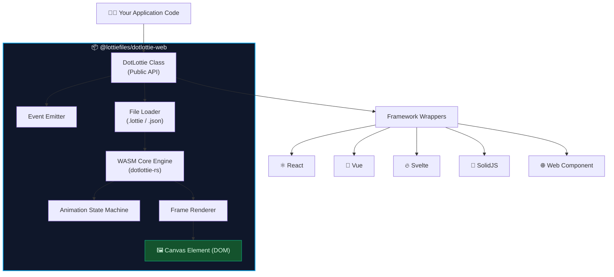
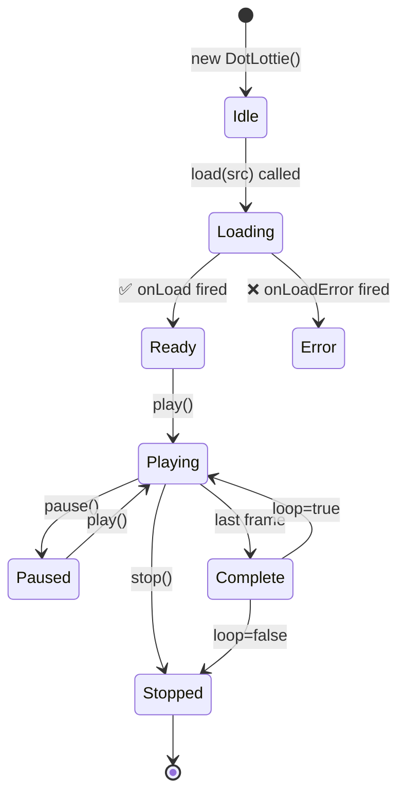
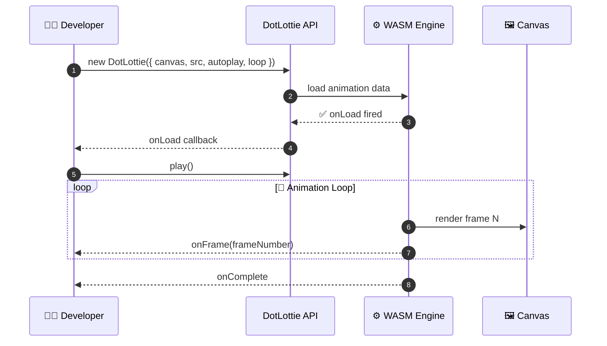
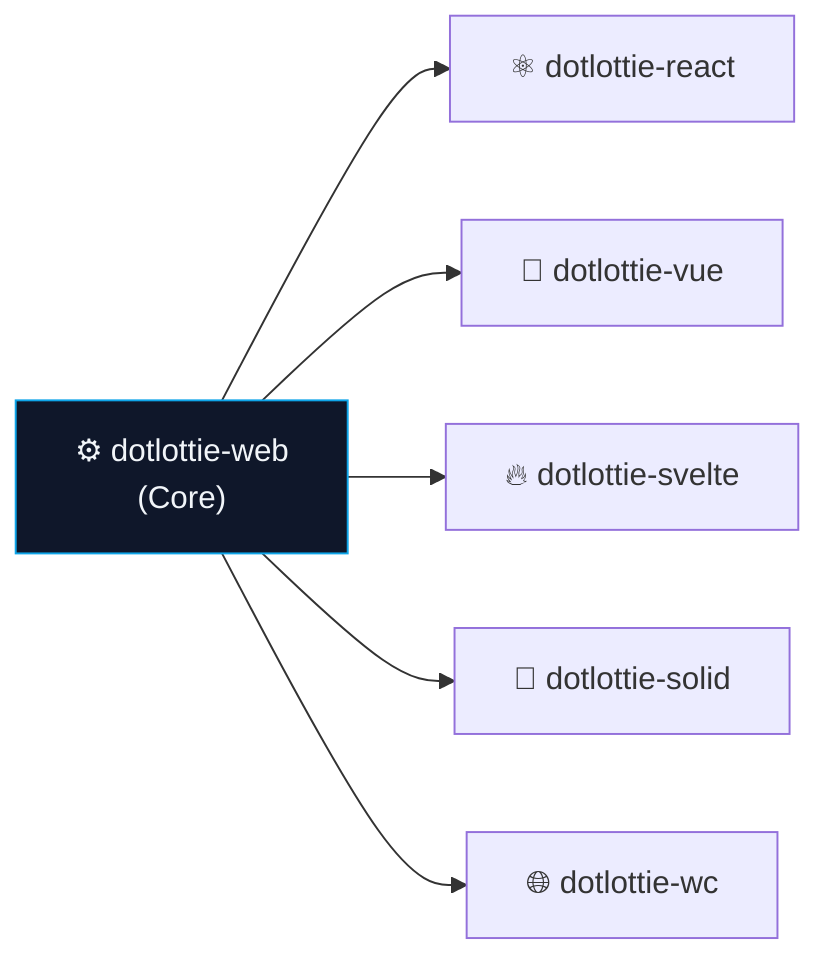

<div align="center">

<!-- 
  ✅ ANIMATION WORKS because banner.svg is a separate file in the repo.
  GitHub STRIPS inline <style>/@keyframes from markdown — but renders
  them fully when SVG is served as an  file.
-->


# 🎬 @lottiefiles/dotlottie-web

**The official, high-performance Lottie & dotLottie animation player for the web.**  
Powered by WebAssembly. Framework-agnostic. Tiny footprint.

[](https://www.npmjs.com/package/@lottiefiles/dotlottie-web)
[](https://bundlephobia.com/package/@lottiefiles/dotlottie-web)
[](https://www.npmjs.com/package/@lottiefiles/dotlottie-web)
[](https://github.com/LottieFiles/dotlottie-web/blob/main/LICENSE)

</div>

---

## ✨ Features

- 🚀 **WebAssembly-powered** rendering engine for buttery-smooth animations
- 📦 **Tiny bundle** — minzipped, tree-shakeable, zero dependencies
- 🖼️ **Dual format support** — `.lottie` (dotLottie) and `.json` (Lottie)
- 🎛️ **Full playback control** — play, pause, stop, speed, loop, direction
- 🔔 **Rich event system** — onLoad, onComplete, onFrame, onError and more
- 🌐 **Framework wrappers** — React, Vue, Svelte, SolidJS, Web Components

---

## 🏗️ Architecture



---

## 🔄 Animation Lifecycle



---

## 🔀 API Data Flow



---

## 🚀 Installation

```bash
npm install @lottiefiles/dotlottie-web
```

---

## 📖 Usage

```js
import { DotLottie } from '@lottiefiles/dotlottie-web';

const dotLottie = new DotLottie({
  canvas: document.getElementById('my-canvas'),
  src: 'https://lottie.host/your-animation-id/animation.lottie',
  autoplay: true,
  loop: true,
});

dotLottie.addEventListener('complete', () => console.log('Done!'));
```

---

## ⚙️ API Reference

| Option / Method | Type | Description |
|---|---|---|
| `canvas` | `HTMLCanvasElement` | Canvas to render into (**required**) |
| `src` | `string` | URL of `.lottie` or `.json` (**required**) |
| `autoplay` | `boolean` | Auto-start on load |
| `loop` | `boolean` | Loop animation |
| `speed` | `number` | Playback speed (default `1`) |
| `.play()` | Method | Start / resume |
| `.pause()` | Method | Pause |
| `.stop()` | Method | Stop + reset |
| `.setSpeed(n)` | Method | Set speed multiplier |
| `.destroy()` | Method | Clean up memory |

---

## 🌐 Framework Support



---

## 📄 License

MIT © [LottieFiles](https://lottiefiles.com)
