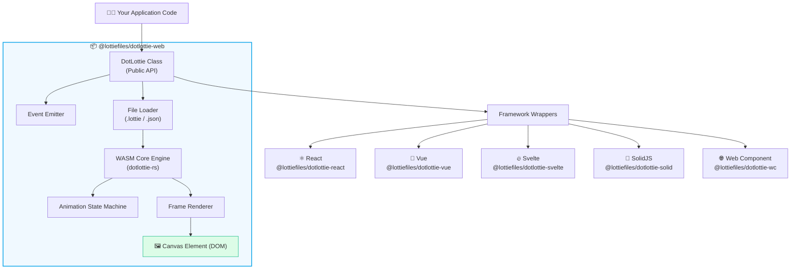
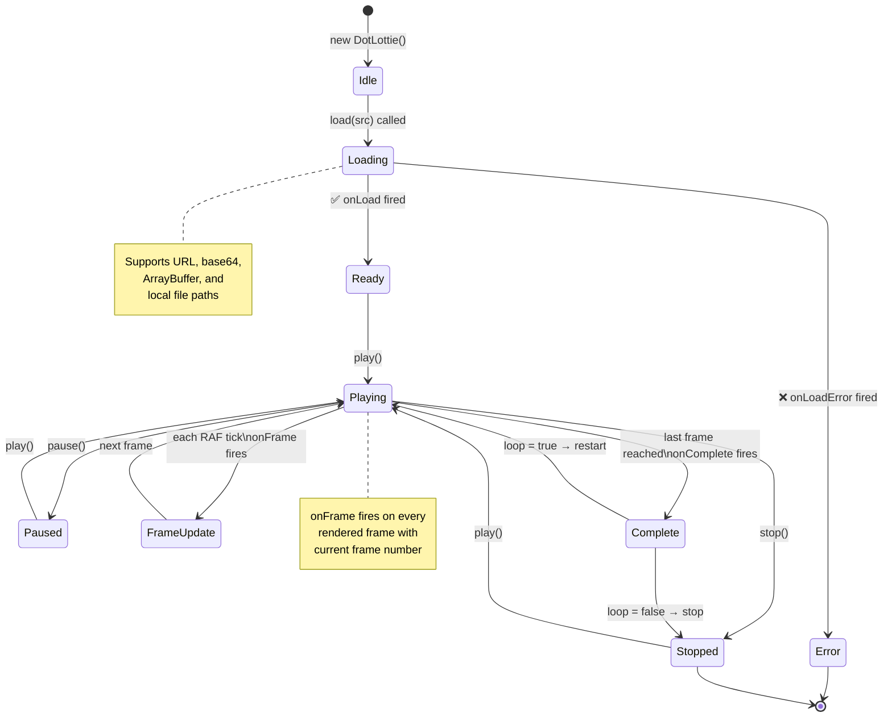
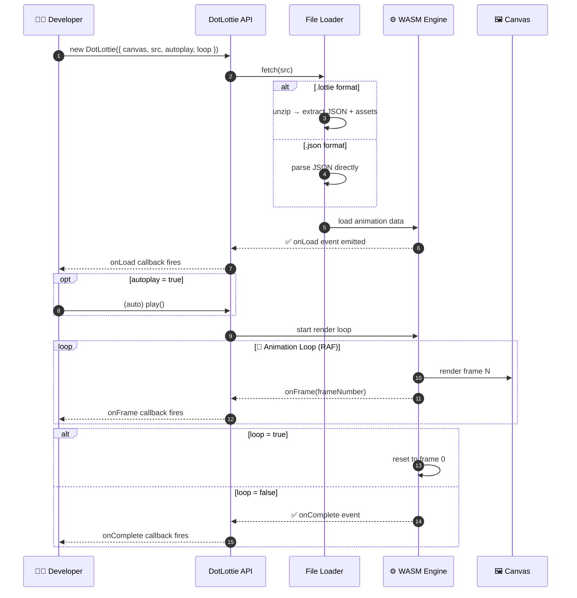
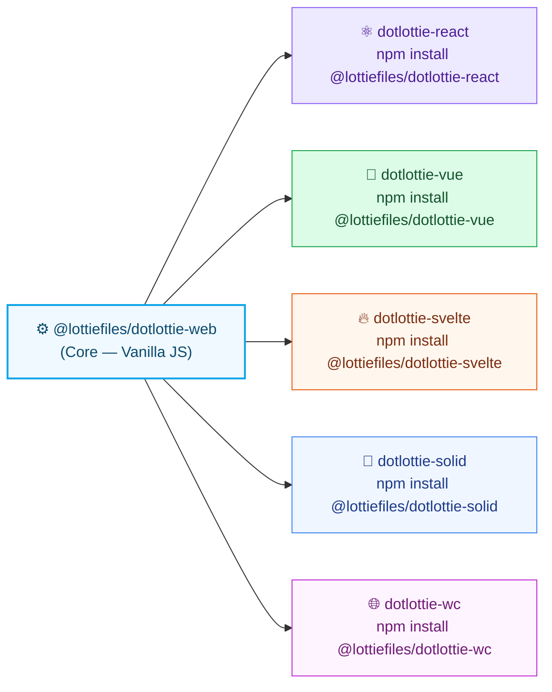
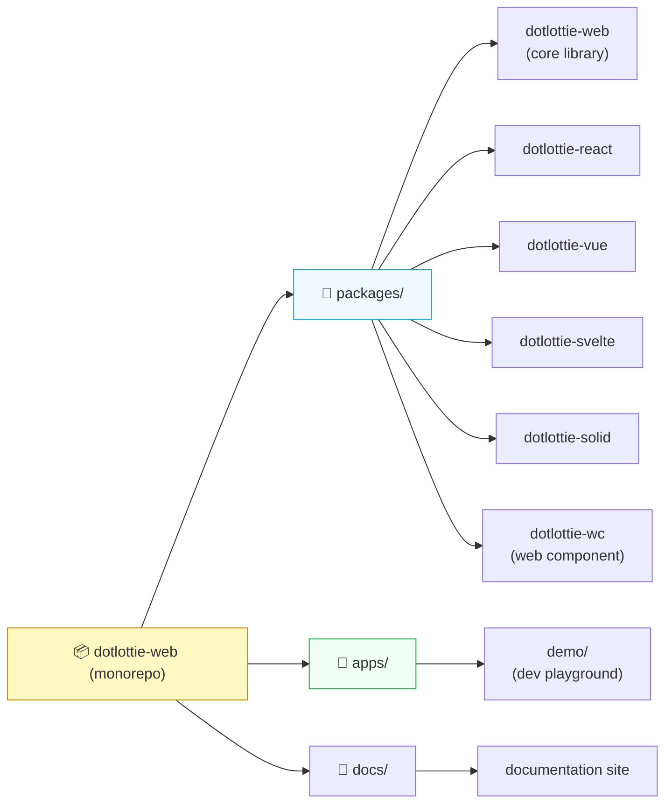

<div align="center">

<!-- ANIMATED SVG HERO BANNER -->
<svg viewBox="0 0 700 140" xmlns="http://www.w3.org/2000/svg" width="700" height="140">
  <defs>
    <linearGradient id="bg" x1="0%" y1="0%" x2="100%" y2="0%">
      <stop offset="0%" style="stop-color:#0ea5e9;stop-opacity:1" />
      <stop offset="100%" style="stop-color:#8b5cf6;stop-opacity:1" />
    </linearGradient>
    <style>
      .dot { animation: bounce 1.4s ease-in-out infinite; }
      .dot1 { animation-delay: 0s; }
      .dot2 { animation-delay: 0.2s; }
      .dot3 { animation-delay: 0.4s; }
      .dot4 { animation-delay: 0.6s; }
      .dot5 { animation-delay: 0.8s; }
      .line { animation: flow 2.5s linear infinite; }
      @keyframes bounce {
        0%, 100% { transform: translateY(0px); opacity: 0.5; }
        50% { transform: translateY(-12px); opacity: 1; }
      }
      @keyframes flow {
        0% { stroke-dashoffset: 200; }
        100% { stroke-dashoffset: 0; }
      }
      .title { font-family: -apple-system, BlinkMacSystemFont, 'Segoe UI', sans-serif; }
      .fade { animation: fadeIn 1s ease-in forwards; }
      @keyframes fadeIn { from { opacity:0; } to { opacity:1; } }
    </style>
  </defs>

  <!-- Background pill -->
  <rect rx="16" ry="16" width="700" height="140" fill="url(#bg)" opacity="0.08"/>

  <!-- Animated flowing line -->
  <path d="M 80 70 Q 200 20 350 70 Q 500 120 620 70"
        stroke="url(#bg)" stroke-width="2" fill="none"
        stroke-dasharray="200" class="line"/>

  <!-- Animated dots on the line -->
  <circle cx="140" cy="48" r="8" fill="#0ea5e9" class="dot dot1"/>
  <circle cx="250" cy="38" r="8" fill="#38bdf8" class="dot dot2"/>
  <circle cx="350" cy="70" r="10" fill="#8b5cf6" class="dot dot3"/>
  <circle cx="450" cy="100" r="8" fill="#a78bfa" class="dot dot4"/>
  <circle cx="560" cy="58" r="8" fill="#0ea5e9" class="dot dot5"/>

  <!-- Title text -->
  <text x="350" y="118" text-anchor="middle" font-size="13"
        fill="#64748b" class="title fade">
    ✦ Render beautiful Lottie &amp; dotLottie animations on the web ✦
  </text>
</svg>

# 🎬 @lottiefiles/dotlottie-web

**The official, high-performance Lottie &amp; dotLottie animation player for the web.**
Powered by WebAssembly. Framework-agnostic. Tiny footprint.

[](https://www.npmjs.com/package/@lottiefiles/dotlottie-web)
[](https://bundlephobia.com/package/@lottiefiles/dotlottie-web)
[](https://www.npmjs.com/package/@lottiefiles/dotlottie-web)
[](https://github.com/LottieFiles/dotlottie-web/blob/main/LICENSE)
[](https://github.com/LottieFiles/dotlottie-web)

</div>

---

## ✨ Features

- 🚀 **WebAssembly-powered** rendering engine for buttery-smooth animations
- 📦 **Tiny bundle** — minzipped, tree-shakeable, no dependencies
- 🖼️ **Dual format support** — `.lottie` (dotLottie) and `.json` (Lottie)
- 🎛️ **Full playback control** — play, pause, stop, speed, loop, direction
- 🔔 **Rich event system** — onLoad, onComplete, onFrame, onError, and more
- 🌐 **Framework wrappers** — React, Vue, Svelte, SolidJS, Web Components
- 🧩 **State machine support** — interactive, stateful animation flows
- 🎨 **Theme support** — dynamic color/property overrides at runtime

---

## 🏗️ Architecture

> How dotlottie-web is structured internally — from your code down to the canvas.



---

## 🔄 Animation Lifecycle

> Every animation goes through these states. Understanding this helps you hook into the right events.



---

## 🔀 API Request / Data Flow

> What happens under the hood from `new DotLottie()` → animation playing on screen.



---

## 🚀 Installation

```bash
# npm
npm install @lottiefiles/dotlottie-web

# yarn
yarn add @lottiefiles/dotlottie-web

# pnpm
pnpm add @lottiefiles/dotlottie-web

# CDN (ESM)
import { DotLottie } from 'https://cdn.jsdelivr.net/npm/@lottiefiles/dotlottie-web/+esm';
```

---

## 📖 Usage

### Basic Setup

```html
<!-- 1. Add a canvas to your HTML -->
<canvas id="my-canvas" width="400" height="400"></canvas>
```

```js
// 2. Import and initialize
import { DotLottie } from '@lottiefiles/dotlottie-web';

const dotLottie = new DotLottie({
  canvas: document.getElementById('my-canvas'),
  src: 'https://lottie.host/your-animation-id/animation.lottie',
  autoplay: true,
  loop: true,
});
```

### Playback Controls

```js
dotLottie.play();           // ▶️ Start / resume
dotLottie.pause();          // ⏸️ Pause at current frame
dotLottie.stop();           // ⏹️ Stop and reset to frame 0
dotLottie.setSpeed(2);      // ⏩ 2× speed
dotLottie.setLoop(true);    // 🔁 Enable looping
dotLottie.setFrame(30);     // ⏭️ Jump to frame 30
```

### Event Handling

```js
dotLottie.addEventListener('load', () => {
  console.log('✅ Animation loaded!');
});

dotLottie.addEventListener('complete', () => {
  console.log('🏁 Animation complete!');
});

dotLottie.addEventListener('frame', ({ currentFrame }) => {
  console.log(`🎞️ Frame: ${currentFrame}`);
});

dotLottie.addEventListener('loadError', (err) => {
  console.error('❌ Load failed:', err);
});
```

---

## ⚙️ API Reference

### Constructor Options

| Option | Type | Default | Description |
|--------|------|---------|-------------|
| `canvas` | `HTMLCanvasElement` | **required** | The canvas element to render into |
| `src` | `string` | **required** | URL or data URI of `.lottie` or `.json` file |
| `autoplay` | `boolean` | `false` | Start playing immediately after load |
| `loop` | `boolean` | `false` | Loop the animation |
| `speed` | `number` | `1` | Playback speed multiplier |
| `mode` | `string` | `"forward"` | Direction: `"forward"`, `"reverse"`, `"bounce"` |
| `backgroundColor` | `string` | `"transparent"` | Canvas background color (hex) |
| `segment` | `[number, number]` | `undefined` | Play only a subset of frames `[startFrame, endFrame]` |
| `useFrameInterpolation` | `boolean` | `true` | Smooth inter-frame blending |
| `themeId` | `string` | `undefined` | Apply a named theme from the .lottie bundle |

### Instance Methods

| Method | Returns | Description |
|--------|---------|-------------|
| `.play()` | `void` | Start or resume animation |
| `.pause()` | `void` | Pause at current frame |
| `.stop()` | `void` | Stop and reset to first frame |
| `.setSpeed(n)` | `void` | Set playback speed (e.g. `2` = 2×) |
| `.setLoop(bool)` | `void` | Enable or disable looping |
| `.setFrame(n)` | `void` | Jump to a specific frame number |
| `.setSegment(start, end)` | `void` | Restrict playback to frame range |
| `.setMode(mode)` | `void` | Set direction (`forward` / `reverse` / `bounce`) |
| `.destroy()` | `void` | Clean up WASM memory and remove listeners |
| `.resize()` | `void` | Recalculate canvas size (call on container resize) |
| `.addEventListener(event, cb)` | `void` | Subscribe to events |
| `.removeEventListener(event, cb)` | `void` | Unsubscribe from events |

### Events

| Event | Payload | Fires When |
|-------|---------|------------|
| `load` | — | Animation file fully loaded and ready |
| `loadError` | `{ error }` | File failed to load or parse |
| `play` | — | Playback started |
| `pause` | — | Playback paused |
| `stop` | — | Playback stopped |
| `complete` | — | Last frame reached (non-looping) |
| `loop` | `{ loopCount }` | Loop iteration completed |
| `frame` | `{ currentFrame }` | Each frame rendered |
| `destroy` | — | Instance destroyed |
| `freeze` | — | Animation frozen (tab inactive) |

---

## 🌐 Framework Support



### React Example

```jsx
import { DotLottieReact } from '@lottiefiles/dotlottie-react';

export default function App() {
  return (
    <DotLottieReact
      src="https://lottie.host/your-id/animation.lottie"
      loop
      autoplay
      style={{ width: 300, height: 300 }}
    />
  );
}
```

### Vue Example

```vue
<template>
  <DotLottieVue
    src="https://lottie.host/your-id/animation.lottie"
    :loop="true"
    :autoplay="true"
    style="width: 300px; height: 300px"
  />
</template>

<script setup>
import { DotLottieVue } from '@lottiefiles/dotlottie-vue';
</script>
```

---

## 🎬 Live Demo (GitHub Pages / Docs)

> Paste this in your `docs/index.html` or any HTML page — GitHub strips `<script>` from `.md` files.

```html
<canvas id="demo-canvas" width="300" height="300"></canvas>
<script type="module">
  import { DotLottie } from 'https://cdn.jsdelivr.net/npm/@lottiefiles/dotlottie-web/+esm';

  new DotLottie({
    canvas: document.getElementById('demo-canvas'),
    src: 'https://lottie.host/4db68bbd-31f6-4cd8-84eb-189de081159a/IGmMCqhzpt.lottie',
    autoplay: true,
    loop: true,
  });
</script>
```

---

## 📁 Package Structure



---

## 🤝 Contributing

Contributions are welcome! Please read the [contributing guide](CONTRIBUTING.md) first.

```bash
# Clone the repo
git clone https://github.com/LottieFiles/dotlottie-web.git
cd dotlottie-web

# Install dependencies (uses pnpm workspaces)
pnpm install

# Build all packages
pnpm build

# Run dev server
pnpm dev
```

---

## 📄 License

MIT © [LottieFiles](https://lottiefiles.com)

---

<div align="center">

Made with ❤️ by the [LottieFiles](https://lottiefiles.com) team

[Website](https://lottiefiles.com) · [Docs](https://developers.lottiefiles.com) · [Discord](https://discord.gg/lottiefiles) · [Twitter](https://twitter.com/lottiefiles)

</div>
